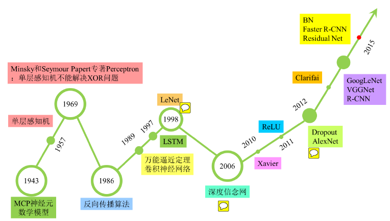
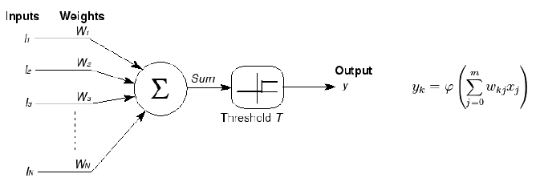

# 人工智能发展史

## 本章节逻辑模型

* 背景
    * -
* 目标
    * -
* 输入
    * -
* 过程
    * -
* 输出
    * -
* 效果
    * -

## 人工智能的三次浪潮

(来自于“深度学习大讲堂”微信公众号, 待修改)

## 第一次浪潮

* 20世纪40年代
    * 1943年, 心理学家McCulloch和数学家Pitts参考生物神经元结构发表了抽象的人工神经元模型 - MP人工神经元模型
        * 当时是希望利用计算机模拟人类神经元的反应过程
        * 神经网络到数学模型的第一步
        * 神经网络思想的起源

    

* 20世纪50年代
    * 1950年，Alan Turning 提出图灵测试来判定计算机是否智能
        * 如果一台机器能够与人类展开对话（通过电传设备）而不能被辨别出其机器身份，那么称这台机器具有智能
        * 这使得"思考的机器"可被验证
    * 1958年, Rosenblatt将MP用于机器学习, 提出了感知机（Perceptron）算法
        * 该算法使用MP模型对输入的多维数据进行二分类，且能够使用梯度下降法从训练样本中自动学习更新权值

* 20世纪60年代
    * 1962年，感知机经数学证明为能够收敛
        * 第一次人工智能浪潮开始

    * 1969年，美国数学家及人工智能先驱Minsky指出感知机只能处理线性分类问题
        * 在其著作中证明了感知器本质上是一种线性模型
        * 连最简单的XOR（亦或）问题都无法正确分类
        * 神经网络的研究因此陷入了近20年的停滞

## 第二次浪潮

* 20世纪80年代
    * 1986年
        * Geoffrey Hinton提出多层感知器(Multi-layer Perceptron, MLP)以及其学习方法BP算法（Back Propagation 反向传播）
            * 引入非线性数学模型元件Sigmoid
            * 有效解决了非线性分类问题
            * 第二次人工智能热潮开始
        * E.B.Hunt等人提出ID3算法，即后来的决策树
            * 符号学派的火花点
    * 1989年
        * Robert Hecht-Nielsen证明了MLP的万能逼近定理
            * 对于任何闭区间内的一个连续函数f，都可以用含有一个隐含层的多层感知器来逼近
            * 该定理的发现极大的鼓舞了神经网络的研究人员
        * Yann LeCun提出LeNet，即后来的卷积神经网络
            * 用于数字识别(Mnist)取得了较好的成绩
            * 然而当时并没有引起足够的重视
* 20世纪90年代
    * 1990年, Schapire提出Boosting算法
        * 提出结合多个弱学习算法可以组成一个整体性能更好的算法 (三个臭皮匠胜过一个诸葛亮)
            * 弱学习算法指稍强于随机算法的算法
        * 集成学习方法 Emsemble Learning的火种
        * 但实践上存在缺陷
    * 1991年
        * BP算法被指出存在缺陷 - 梯度消失问题
            * 即在误差梯度后向传递的过程中，后层梯度以乘性方式叠加到前层，由于Sigmoid函数的饱和特性，后层梯度本来就小，误差梯度传到前层时几乎为0
            * [注] 对于任何闭区间内的一个连续函数f，存在MLP模型可以逼近他， 但这个MLP模型不一定能用BP算法找出来
    * 1995年
        * Freund和schapire提出了 AdaBoost (Adaptive Boosting)算法
            * 基于Boosting算法的改进
            * 很好地改善了在实践上的缺陷

        * 统计学家Vapnik提出线性SVM
            * 有完美的数学理论推导
            * 在当时的线性分类问题上取得了最好的成绩
            * 类比学习方法的代表
    * 1997年
        * Hochreiter & Schmidhuber提出LSTM模型，第一个效果显著的反馈神经网络
            * 该模型在序列建模上的特性非常突出
            * 然而当时人工神经网络处理下坡期，没有引起足够的重视

* 21世纪初
    * 2000年，Kernel SVM被提出
        * 透过"核化"将原来只能解决分类问题的SVM能够解决非线性分类的问题
        * 分类效果非常好，第二次神经网络浪潮结束
    * 2001年，随机森林被提出
        * 决策树和集成学习方法的结合
        * 比集成学习方法中的AdaBoost有更好的表现

### 第三次浪潮

* 2006年（深度学习元年），Geoffrey Hinton提出了梯度消失问题的解决方案
    * 无监督预训练对权值进行初始化 + 有监督训练微调
    * 但是由于没有特别有效的实验验证，故没有引起重视。

* 2011年，微软首次将深度学习应用在语音识别上，取得了重大突破

* 2012年，Geoffrey Hinton课题组为参加ImageNet图像识别比赛
    * 通过构建的CNN网络 AlexNet 一举夺得冠军
    * 碾压第二名（SVM方法）的分类性能
    * 两大特点
        1. 充分证明06年提出的梯度消失问题的解决方案有效
        2. 梯度消失问题的解决方案
    * CNN自此受到关注

## 参考材料

* Machine Learning: 一部气势恢宏的人工智能发展史 - ZOL新闻中心 [link](http://news.zol.com.cn/604/6040334.html)
* 深度学习（一）深度学习的发展历史 - CSDN博客 [link](http://blog.csdn.net/u012177034/article/details/52252851)
