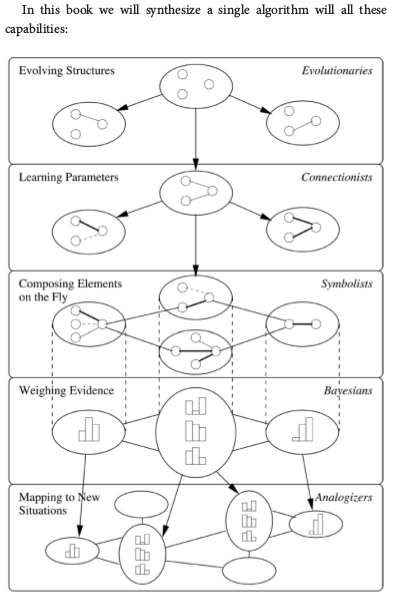

# 终极算法

## 本章节逻辑模型

* 背景
    * -
* 目标
    * -
* 输入
    * -
* 过程
    * -
* 输出
    * -
* 效果
    * -

## 引言

* *The Master Algorithm*一書提出了機器學習5大學派算法結合的框架，我們來分析其中的邏輯關係 

##

## 參考材料

* *The Master Algorithm*
